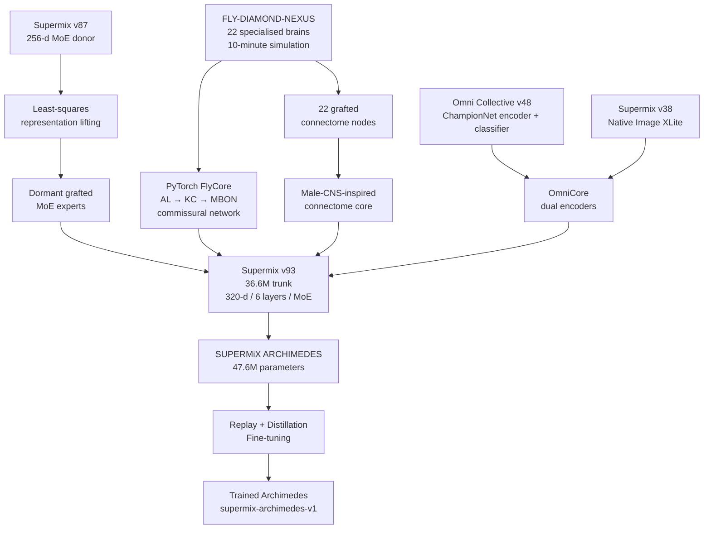

# Supermix Archimedes

**Supermix Archimedes** is an experimental multi-source neural model built by grafting, distilling, fine-tuning, and connecting multiple Supermix/Omni checkpoints with a learned 22-brain Fly Lab system.

Rather than simply averaging weights, Archimedes integrates heterogeneous neural subsystems around the **Supermix v93** language-model trunk.

[](https://huggingface.co/Kai9987kai/archimedes-final-model)

## Full Model Download

The complete final model is available on Hugging Face:

**https://huggingface.co/Kai9987kai/archimedes-final-model**

This GitHub repository contains the architecture, grafting pipeline, Fly Lab integration, training code, evaluation utilities, receipts, and supporting corpora. The Hugging Face repository is the canonical location for the downloadable final trained model.

## Source Systems

Archimedes combines:

- [Supermix v93](https://huggingface.co/Kai9987kai/supermix-v93) — primary language-model trunk.
- [Supermix v87](https://huggingface.co/Kai9987kai/supermix-v87) — donor Mixture-of-Experts modules.
- [Omni Collective v48 Frontier](https://huggingface.co/Kai9987kai/omni-collective-v48-frontier) — auxiliary Omni encoder/classifier.
- [Supermix v38 Native Image XLite FP16](https://huggingface.co/Kai9987kai/supermix-v38-native-image-xlite-fp16) — native image-generation branch.
- [FLY-DIAMOND-NEXUS](https://github.com/kai9987kai/FLY-DIAMOND-NEXUS) — 22-role adaptive Fly Lab neural/simulation system.

> **Status:** Experimental research prototype. This project investigates architectural model grafting, cross-dimensional expert transfer, controller distillation, connectome-inspired routing, and multimodal model integration.

## Architecture



## Design

Most checkpoint-merging techniques assume compatible architectures. Archimedes instead performs targeted grafts between systems with different dimensions, vocabularies, and objectives.

The project:

1. preserves Supermix v93 as the main trunk;
2. identifies unused/dead Mixture-of-Experts capacity;
3. maps v87 expert weights from the 256-dimensional space into v93's 320-dimensional residual space;
4. inserts those experts into dormant v93 MoE slots;
5. ports the learned Fly Lab controller into PyTorch;
6. inserts 22 Fly roles into the existing connectome representation;
7. retains v48 and v38 as independent Omni encoders instead of destructively averaging unrelated weights;
8. activates grafts gradually through trainable gates;
9. fine-tunes with replay and teacher distillation to reduce catastrophic forgetting.

## Supermix v93 Trunk

The current implementation describes the v93-derived trunk as approximately:

```text
36.6M trunk parameters
320-dimensional residual representation
6 layers
72 MoE slots per MoE layer
recursive thinking components
832-slot male-CNS-inspired connectome system
```

The v93 tokenizer and language-model head remain the basis of the combined model.

## v87 Expert Grafting

Supermix v87 uses a 256-dimensional hidden representation while v93 uses 320 dimensions. Direct expert transplantation is therefore not possible.

Archimedes fits least-squares mappings using the token embeddings shared between the models:

```text
v87 hidden space -> v93 hidden space
v93 hidden space -> v87 hidden space
```

The recorded graft uses **8,635 shared vocabulary tokens**.

Selected v87 experts are transformed into the v93 residual space and placed into otherwise unused v93 expert slots.

### Dormant Expert Strategy

New experts are initially inserted in a dormant state:

```text
expert weights      = imported
router weights      = imported/transformed
expert alive state  = disabled
router bias         = suppressed
```

The default training schedule begins waking them at 10% progress and has them fully introduced by 50% progress.

This reduces abrupt routing disruption.

## FlyCore

The repository includes a headless Fly Lab runner:

```text
fly_lab_headless.cjs
```

It executes the learned FLY-DIAMOND-NEXUS system without rendering and records both the final learned state and experience telemetry.

The reference run recorded by the current receipt used:

```text
Duration:         10 minutes
Simulation steps: 309,227
Experience rows:  154,611
Agents:           3
Brains:           22
Seed:             2077
Coupling:         0.8
```

### 22 Fly Roles

```text
forager
navigator
sentinel
vault
pioneer
optic
executive
metabolic
lal
vnc_cpg
ammc
pb
eb
no
aotu
smp
plume
climate
threat_forecast
route_memory
uncertainty
social
```

These roles contribute to higher-level descending systems such as reflex, goal, exploration, and support.

## Fly Neural Path

The PyTorch FlyCore reproduces major learned components of the simulator:

```text
sensory / Antennal-Lobe representation
        |
        v
Kenyon-cell representation
        |
        v
MBON output system
        |
        v
22-brain commissural network
        |
        v
gated descending consensus
        |
        v
UP / DOWN / LEFT / RIGHT
```

The implementation also contains computational mechanisms inspired by APL inhibition, DAN-LTD-style plasticity, sparse KC activity, commissural coupling, neurogenesis, brain-specific descending outputs, and consensus gating.

These are artificial computational abstractions and should not be interpreted as a biologically complete model of a real fly brain.

## Fly-to-Language Bridge

The language trunk communicates with FlyCore through a learned sensory interface:

```text
320-dimensional trunk state
        |
        v
14 sensory / glomerular dimensions
        |
        v
22 Fly brains
        |
        v
22 x 4 descending votes
        +
4 consensus logits
        |
        v
learned gate
        |
        v
v93 residual stream
```

## Connectome Grafting

The same 22 Fly roles are inserted into free positions in the v93 connectome representation.

The current receipt records:

```text
Fly nodes:          22
Slots used:         804-825
CNS nodes alive:    826
Fly-Fly edges:      462
Fly-biological:     218
```

Examples of heuristic biological analogues include ORN/PAM for the forager role, EPG/Delta7 for navigator, Kenyon-cell families for vault/route memory, visual T4/T5/LC pathways for optic processing, and descending/VNC systems for motor control.

These mappings are architectural heuristics, not claims of biological equivalence.

## OmniCore

The v48 and v38 models are retained as independent components rather than directly weight-merged.

```text
Prompt
  |---> v48 ChampionNet encoder
  |       `---> hierarchical/MoE classification head
  |
  `---> v38 ChampionNet encoder
          `---> 64x64 native-image decoder

                |
                v
           pooled states
                |
                v
          learned bridge
                |
                v
            v93 trunk
```

Current recorded Omni parameter counts:

```text
v48 parameters: 5,223,801
v38 parameters: 5,582,531
```

The default training pipeline freezes the original Omni tensors while training their integration with the combined trunk.

## Parameter Count

| Component | Parameters |
|---|---:|
| v93-derived trunk | 36,594,245 |
| FlyCore | 59,116 |
| OmniCore | 10,971,516 |
| **Total** | **47,624,877** |

The current combined architecture contains approximately **47.6 million parameters**.

## Two-Stage Build

### Stage 1 — Structural Grafting

```bash
python archimedes/build_archimedes.py
```

This stage loads v93, lifts and installs dormant v87 experts, loads and calibrates FlyCore, grafts Fly roles into the connectome, loads v48/v38 into OmniCore, records source hashes and graft metadata, and writes the initial checkpoint.

Default output:

```text
archimedes/checkpoints/supermix_archimedes_grafted.pt
```

The current stored receipt reports a maximum v93-vs-grafted logit difference of:

```text
0.3197147846
```

so the recorded build should not be described as perfectly bit-identical to v93.

### Stage 2 — Distillation and Fine-Tuning

```bash
python archimedes/train_archimedes.py --steps 400 --batch 8
```

The training objective combines supervised language modeling, v93 self-distillation, v87 cross-vocabulary distillation, Fly consensus supervision, and Fly sensory reconstruction.

Default distillation weights:

```text
kd93    = 0.5
kd87    = 0.25
fly_aux = 1.0
```

## Training Data

The repository contains replay corpora under `corpus/`.

The current Omni/science report records **1,943 rows across 17 tasks**, including impulse, Ohm's law, spring energy, acceleration, momentum, work, power, voltage, wave speed, molarity, combinations, permutations, and arithmetic series.

The code corpus contains **300 rows across 3 tasks**:

```text
code_range_sum
code_list_count
code_neg_index
```

The project also contains a mathematical replay corpus used during training.

## Current Recorded Training Run

```text
Training steps:       400
Batch size:           8
Sequence length:      128

Trunk learning rate:  3e-5
Graft learning rate:  2e-4

v93 KD weight:        0.5
v87 KD weight:        0.25
Fly auxiliary weight: 1.0

Replay rows:          3,743
Fly rows:             4,000
Training rows:        7,356
Development rows:     387

Vocabulary additions: 36
Final vocabulary:     9,451
UNK rate:             0.0

Training time:        ~72 minutes
Final dev loss:       1.7326595
```

Recorded development loss decreased from approximately 6.78 before fine-tuning to 1.73 after 400 steps.

This is an internal project metric and is not a standardized comparison against unrelated language models.

## Internal Accuracy Probe

`probe_accuracy.py` runs the project's answer checker over a deterministic sample of generated corpus problems.

The committed `probe_results.json` currently reports:

```text
Accuracy: 0.9166667
44 correct / 48 automatically checkable answers
```

The probe begins from a 60-row sample. It is a small internal regression test, not a general-purpose language-model benchmark.

## Repository Structure

```text
supermix-archimedes/
|
|-- archimedes/
|   |-- build_archimedes.py
|   |-- train_archimedes.py
|   `-- src/
|       |-- archimedes_core.py
|       |-- answer_check.py
|       |-- device_utils.py
|       |-- malecns_connectome.py
|       |-- mimomix_core.py
|       |-- mimomix_decoding.py
|       |-- mimomix_text.py
|       |-- natural_phrasings.py
|       |-- neurogenesis.py
|       |-- prompt_normaliser.py
|       |-- step_audit.py
|       |-- train_mimomix_talk.py
|       `-- champion/
|
|-- checkpoints/
|   |-- smoke.receipt.json
|   |-- supermix_archimedes.receipt.json
|   |-- supermix_archimedes_grafted.receipt.json
|   `-- train.log
|
|-- corpus/
|   |-- code.jsonl
|   |-- code.report.json
|   |-- math.jsonl
|   |-- omni.jsonl
|   `-- omni.report.json
|
|-- models/
|-- download_models.py
|-- fly_lab_headless.cjs
|-- inspect_ckpt.py
|-- probe_accuracy.py
|-- probe_results.json
|-- test_build.py
`-- original prompt.txt
```

## Requirements

The Python side primarily requires:

```text
Python 3
PyTorch
NumPy
huggingface_hub
```

Fly simulation additionally requires Node.js.

Install the basic Python dependencies with:

```bash
python -m pip install torch numpy huggingface_hub
```

## Installation

Clone the repository:

```bash
git clone https://github.com/kai9987kai/supermix-archimedes.git
cd supermix-archimedes
```

Install Python dependencies:

```bash
python -m pip install torch numpy huggingface_hub
```

Download the source models:

```bash
python download_models.py
```

The downloader retrieves the v93, v87, v48, and v38 source repositories into `models/`.

## Reproducing the Fly Lab Run

Clone FLY-DIAMOND-NEXUS into the path expected by the headless runner:

```bash
git clone https://github.com/kai9987kai/FLY-DIAMOND-NEXUS.git fly-diamond-nexus
```

Run the reference simulation:

```bash
node fly_lab_headless.cjs --minutes 10 --seed 2077 --out fly_run
```

The run produces the learned snapshot, experience log, and receipt consumed by the Python grafting stage.

## Building Archimedes

```bash
python archimedes/build_archimedes.py \
    --out archimedes/checkpoints/supermix_archimedes_grafted.pt \
    --fly_run fly_run \
    --experts_per_layer 12 \
    --calib_rows 4000
```

## Training Archimedes

```bash
python archimedes/train_archimedes.py \
    --inp archimedes/checkpoints/supermix_archimedes_grafted.pt \
    --out archimedes/checkpoints/supermix_archimedes.pt \
    --steps 400 \
    --batch 8 \
    --seq 128 \
    --fly_rows 4000 \
    --lr_trunk 3e-5 \
    --lr_graft 2e-4 \
    --kd93 0.5 \
    --kd87 0.25 \
    --fly_aux 1.0 \
    --wake 0.1,0.5 \
    --eval_every 50 \
    --seed 2026 \
    --threads 8
```

## Loading a Local Checkpoint

```python
import sys

sys.path.insert(0, "archimedes/src")

from archimedes_core import load_archimedes
from train_mimomix_talk import generate_reply

model, tokenizer, payload = load_archimedes(
    "archimedes/checkpoints/supermix_archimedes.pt"
)

model.eval()

result = generate_reply(
    model,
    tokenizer,
    "What is the impulse from a force of 46 N acting for 7 seconds?",
    max_new_tokens=96,
)

print(result["reply"])
```

For most users who only want the finished trained artifact, use the **[full model on Hugging Face](https://huggingface.co/Kai9987kai/archimedes-final-model)** instead of rebuilding from source.

## Evaluation

Run the current accuracy probe:

```bash
python probe_accuracy.py 60
```

Compare v93 and the initial graft:

```bash
python probe_accuracy.py 60 v93 grafted
```

Evaluate a trained checkpoint:

```bash
python probe_accuracy.py 60 archimedes/checkpoints/supermix_archimedes.pt
```

Integration validation is available through:

```bash
python test_build.py
```

## Reproducibility Receipts

A key design goal is provenance rather than producing an opaque merged checkpoint.

Receipts record source SHA-256 hashes, Fly Lab seed and telemetry, snapshot hashes, expert graft assignments, representation-fit statistics, connectome graft details, parameter counts, training hyperparameters, gate values, vocabulary changes, and training history.

See:

```text
checkpoints/supermix_archimedes.receipt.json
checkpoints/supermix_archimedes_grafted.receipt.json
```

## Checkpoint Format

Archimedes identifies the combined checkpoint schema as:

```text
supermix-archimedes-v1
```

It extends the Supermix talk-checkpoint format with an `archimedes` metadata object containing source, graft, Fly Lab, Omni, and training receipts.

## Research Direction

Supermix Archimedes explores a progression from conventional model merging toward modular neural-system integration:

```text
MODEL MERGING
     |
     v
WEIGHT TRANSFER
     |
     v
ARCHITECTURAL GRAFTING
     |
     v
CROSS-MODEL DISTILLATION
     |
     v
SPECIALISED NEURAL SUBSYSTEMS
     |
     v
SHARED ADAPTIVE MODEL
```

Instead of asking only whether two checkpoints can be averaged, Archimedes asks whether independently trained neural systems can be translated into compatible representation spaces, grafted into unused capacity, connected through trainable interfaces, and then co-adapted into one model.

## Limitations

This is an experimental architecture. The internal probe is small and project-specific; architectural complexity does not automatically imply stronger general reasoning; the Fly Lab is an artificial neural simulation rather than an exact biological nervous system; connectome labels are computational analogies; model integration can introduce regressions; and substantially broader independent benchmarking would be required before making strong capability claims.

## Related Projects

- [Archimedes Final Model — full download](https://huggingface.co/Kai9987kai/archimedes-final-model)
- [Supermix v93](https://huggingface.co/Kai9987kai/supermix-v93)
- [Supermix v87](https://huggingface.co/Kai9987kai/supermix-v87)
- [Omni Collective v48 Frontier](https://huggingface.co/Kai9987kai/omni-collective-v48-frontier)
- [Supermix v38 Native Image XLite FP16](https://huggingface.co/Kai9987kai/supermix-v38-native-image-xlite-fp16)
- [FLY-DIAMOND-NEXUS](https://github.com/kai9987kai/FLY-DIAMOND-NEXUS)

## Author

Developed as part of the **Kai9987kai / Supermix** experimental AI-model ecosystem.

- GitHub: https://github.com/kai9987kai
- Hugging Face: https://huggingface.co/Kai9987kai

## License

A dedicated `LICENSE` file is not currently present in this repository.

Until a license is explicitly added, users should not assume permission for redistribution, modification, or commercial reuse beyond rights granted by applicable law. Licensing of source checkpoints and upstream components should also be checked independently.

## Disclaimer

Supermix Archimedes is an experimental research project. Outputs may be incorrect, inconsistent, or unpredictable. Internal evaluation results are provided for reproducibility and engineering comparison only and should not be interpreted as evidence of biological equivalence, general intelligence, or production readiness.
